# ZAVIO - System Architecture

ZAVIO is built on a modern, decoupled architecture designed for speed, intelligence, and accessibility.

---

## 🔄 System Workflow

```mermaid
flowchart TB
    subgraph INPUT["📥 INPUT LAYER"]
        A1[🎤 Voice Input<br/>Web Speech API] --> B1
        A2[⌨️ Text Input<br/>Command Center] --> B1
        A3[📎 File Upload<br/>Images/Docs] --> B1
        B1[Input Processor]
    end

    subgraph FRONTEND["🖥️ FRONTEND - React/Vite"]
        B1 --> C1[App.tsx<br/>Main Controller]
        C1 --> C2{Voice Mode?}
        C2 -->|Yes| C3[Set VoiceMode = true]
        C2 -->|No| C4[Standard Processing]
        C3 --> D1
        C4 --> D1
    end

    subgraph API["🌐 API LAYER"]
        D1[geminiService.ts<br/>API Client] -->|POST /api/analyze| E1
    end

    subgraph BACKEND["⚙️ BACKEND - Express/Node.js"]
        E1[server/index.ts<br/>Route Handler]
        E1 --> F1[orchestrator.ts<br/>Task Classifier]
        F1 --> F2{Detect Task Type}
        F2 -->|Code| G1[Qwen Coder]
        F2 -->|Voice/Doc| G2[Gemini Flash]
        F2 -->|General| G3[Gemma 3]
        F2 -->|Search| G4[Perplexity]
    end

    subgraph AI["🤖 AI INTELLIGENCE - OpenRouter"]
        G1 & G2 & G3 & G4 --> H1[openrouterService.ts]
        H1 --> H2[Parse JSON Response]
        H2 --> H3{Task Detected?}
        H3 -->|Yes| H4[Extract detectedTask]
        H3 -->|No| H5[Standard Response]
    end

    subgraph OUTPUT["📤 OUTPUT LAYER"]
        H4 --> I1[Save to localStorage<br/>zavio_tasks]
        H5 --> I2[Return AnalysisResult]
        I1 --> I2
        I2 --> J1[Update Feed State]
        J1 --> J2{VoiceMode?}
        J2 -->|Yes| J3[🔊 Auto-Speak Response<br/>SpeechSynthesis]
        J2 -->|No| J4[📝 Display in Chat]
        J3 --> J4
    end

    subgraph SYNC["🔁 REAL-TIME SYNC"]
        I1 -->|Storage Event| K1[NotebookPanel.tsx]
        K1 --> K2[Task List Updates]
    end
```

---

## 📋 Step-by-Step Workflow

| Step | Component | Action |
|------|-----------|--------|
| **1** | User | Speaks or types a command |
| **2** | `App.tsx` | Captures input, sets voice mode if applicable |
| **3** | `geminiService.ts` | Sends request to backend `/api/analyze` |
| **4** | `orchestrator.ts` | Classifies task type (code, voice, search, general) |
| **5** | `openrouterService.ts` | Routes to appropriate AI model via OpenRouter |
| **6** | AI Model | Generates response + detects tasks |
| **7** | Backend | Returns `AnalysisResult` with `detectedTask` field |
| **8** | `App.tsx` | Saves task to `localStorage` if detected |
| **9** | `NotebookPanel.tsx` | Listens for storage event, updates task list |
| **10** | Output | Displays response + auto-speaks if voice mode |

## 📂 Core Modules Explained

### 1. Frontend Architecture (Client)
- **Framework**: React 18 with Vite for ultra-fast HMR.
- **Styling**: Vanilla CSS + Tailwind for the "Cyberpunk/Sci-Fi" glassmorphism theme.
- **Voice System**:
  - **STT (Speech-to-Text)**: Uses native Web Speech API for continuous listening and silence detection.
  - **TTS (Text-to-Speech)**: Uses SpeechSynthesis with natural phrasing and stop control.
- **State Management**: React Hooks (`useState`, `useRef`, `useEffect`) and custom storage event listeners for cross-component sync.

### 2. Backend Orchestration (Server)
- **Express JS**: Handles API routing for decisions, sessions, and analytics.
- **The Orchestrator**: Logic layer that analyzes user intent and routes to the most efficient AI model (e.g., routing code queries to Qwen).
- **Session Store**: A lightweight file-based system that persists chat history and decisions without the overhead of a heavy database.

### 3. AI Intelligence Layer
- **OpenRouter Service**: A unified bridge to access multiple LLMs via a single API key.
- **Model Specialization**:
  - **Gemini 2.0 Flash**: Powers voice interactions and document analysis.
  - **Qwen Coder 2.5**: Specialized for software engineering and debugging.
  - **Gemma 3**: Handlers general assistance and creative strategy.

### 4. Connectivity & Privacy
- **Cloudflare Tunnel**: Encapsulates the local development server into a secure HTTPS tunnel, bypassing NAT/Firewall and enabling remote access on mobile devices without exposing your local IP.

---

## 🔄 Data Lifecycle

1. **Input**: User speaks or types a command.
2. **Analysis**: AI extracts intent, risk level, and potential tasks.
3. **Auto-Action**: 
   - Tasks are identified and saved to `localStorage`.
   - The task list panel detects the storage change and updates in real-time.
4. **Execution**: Relevant code or business strategy is generated.
5. **Feedback**: Results are rendered via Markdown and spoken back using the TTS engine.
