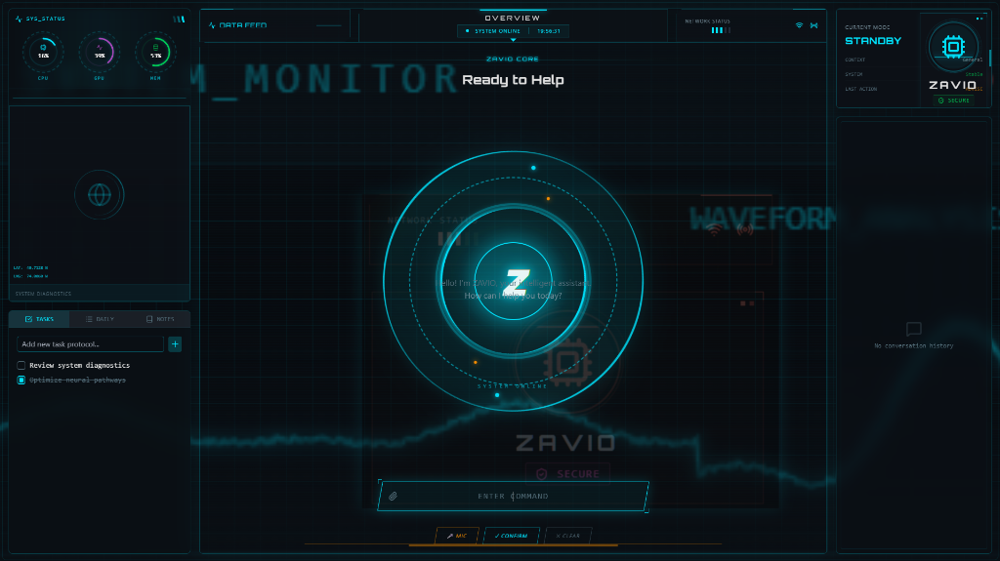

<p align="center">
  
</p>

<h1 align="center">🤖 ZAVIO - Intelligent Operating Assistant</h1>

<p align="center">
  <b>Your AI-Powered Command Center for Everything</b><br/>
  <i>Voice Control • Multi-Model AI • Task Automation • Real-Time Analytics</i>
</p>

<!-- GitHub Stats Badges -->
<p align="center">
  <a href="https://github.com/Zavmedia/ZAVIO/stargazers"></a>
  <a href="https://github.com/Zavmedia/ZAVIO/network/members"></a>
  <a href="https://github.com/Zavmedia/ZAVIO/issues"></a>
  <a href="https://github.com/Zavmedia/ZAVIO/blob/main/LICENSE"></a>
</p>

<!-- Tech Stack Badges -->
<p align="center">
  
  
  
  
  
</p>

<!-- AI Model Badges -->
<p align="center">
  
  
  
  
</p>

<!-- Status Badges -->
<p align="center">
  
  
  
  
  
</p>

<p align="center">
  <a href="#-demo">View Demo</a> •
  <a href="#-features">Features</a> •
  <a href="#-quick-start">Quick Start</a> •
  <a href="#-contributing">Contributing</a>
</p>

---

## ⚡ What is ZAVIO?

ZAVIO is a **next-generation AI assistant** with a stunning cyberpunk interface. It combines the power of multiple AI models (Gemini, Qwen, Gemma) with voice control, task automation, and real-time system analytics.

> 🎯 **Think of it as JARVIS meets ChatGPT** - but open source and running locally on your machine.

### 🎬 Demo

https://github.com/user-attachments/assets/demo-placeholder

---

## ✨ Features

<table>
<tr>
<td width="50%">

### 🎙️ Voice Control
- **Hands-free operation** with Web Speech API
- Automatic silence detection (2s auto-submit)
- Natural voice responses with premium voices
- Global stop button for interruption

</td>
<td width="50%">

### 🧠 Multi-Model AI
- **Gemini 2.0 Flash** for documents & voice
- **Qwen3** for coding & technical tasks
- **Gemma 3** for general conversations
- Smart auto-routing based on query type

</td>
</tr>
<tr>
<td width="50%">

### ✅ Smart Task Detection
- AI automatically detects tasks in conversation
- "I need to call John tomorrow" → Auto-added to tasks
- Real-time sync across all panels
- Never forget important action items

</td>
<td width="50%">

### 📊 Real-Time Analytics
- Live CPU, GPU, Memory monitoring
- API latency tracking
- ML metrics dashboard
- System health visualization

</td>
</tr>
<tr>
<td width="50%">

### 🎨 Cyberpunk UI
- Stunning neon-themed dark interface
- Animated waveform visualizations
- Glassmorphism effects
- Fully responsive design

</td>
<td width="50%">

### 🔒 Privacy First
- **100% local processing**
- Your data never leaves your machine
- API keys stored securely in `.env`
- No telemetry or tracking

</td>
</tr>
</table>

---

## 🚀 Quick Start

### Prerequisites

<p>
  
  
  
</p>

### Installation

```bash
# Clone the repository
git clone https://github.com/Zavmedia/ZAVIO.git
cd ZAVIO

# Install dependencies
npm install

# Configure environment
cp .env.example .env
# Add your OPENROUTER_API_KEY to .env

# Start the application
npm run dev
```

Then open **http://localhost:5173** 🎉

---

## 🛠️ Tech Stack

<table>
<tr>
<td align="center" width="96">
  
  <br>React 18
</td>
<td align="center" width="96">
  
  <br>TypeScript
</td>
<td align="center" width="96">
  
  <br>Vite 6
</td>
<td align="center" width="96">
  
  <br>Tailwind
</td>
<td align="center" width="96">
  
  <br>Node.js
</td>
<td align="center" width="96">
  
  <br>Express
</td>
</tr>
</table>

| Category | Technologies |
|----------|-------------|
| **Frontend** | React 18, TypeScript, Vite 6, Tailwind CSS |
| **Backend** | Node.js, Express.js, tsx |
| **AI Models** | Gemini 2.0, Qwen3-80B, Gemma 3-27B |
| **APIs** | OpenRouter, Web Speech API |
| **Styling** | Custom Cyberpunk Theme, Lucide Icons |

---

## 📁 Project Structure

```
ZAVIO/
├── 📂 components/       # React UI components
│   ├── CommandCenter.tsx    # Main input interface
│   ├── NotebookPanel.tsx    # Tasks & notes management
│   └── MarkdownRenderer.tsx # Rich text rendering
├── 📂 server/           # Backend API
│   ├── services/            # AI orchestration
│   └── routes/              # API endpoints
├── 📂 services/         # Frontend services
├── 📂 assets/           # Images & media
├── App.tsx              # Main application
└── README.md            # You are here!
```

---

## 🎯 Roadmap

- [x] Multi-model AI orchestration
- [x] Voice input with silence detection
- [x] Auto voice response
- [x] Smart task detection
- [x] Real-time system analytics
- [ ] Image generation (DALL-E/SD)
- [ ] Perplexity research integration
- [ ] Custom voice models
- [ ] Plugin system
- [ ] Multi-language support

---

## 🤝 Contributing

<p>
  
</p>

Contributions are what make the open source community amazing! Any contributions you make are **greatly appreciated**.

1. Fork the Project
2. Create your Feature Branch (`git checkout -b feature/AmazingFeature`)
3. Commit your Changes (`git commit -m 'Add some AmazingFeature'`)
4. Push to the Branch (`git push origin feature/AmazingFeature`)
5. Open a Pull Request

---

## 💬 Community

<p>
  <a href="https://github.com/Zavmedia/ZAVIO/stargazers"></a>
  <a href="https://github.com/Zavmedia/ZAVIO/issues"></a>
  <a href="https://github.com/Zavmedia/ZAVIO/discussions"></a>
</p>

---

## 📄 License

Distributed under the MIT License. See `LICENSE` for more information.

---

<p align="center">
  
</p>

<p align="center">
  <sub>If you find this project useful, please consider giving it a ⭐</sub>
</p>

<p align="center">
  <a href="https://github.com/Zavmedia/ZAVIO/stargazers">
    
  </a>
  <a href="https://github.com/Zavmedia/ZAVIO/network/members">
    
  </a>
  <a href="https://github.com/Zavmedia/ZAVIO/watchers">
    
  </a>
</p>

---

<p align="center">
  
</p>
